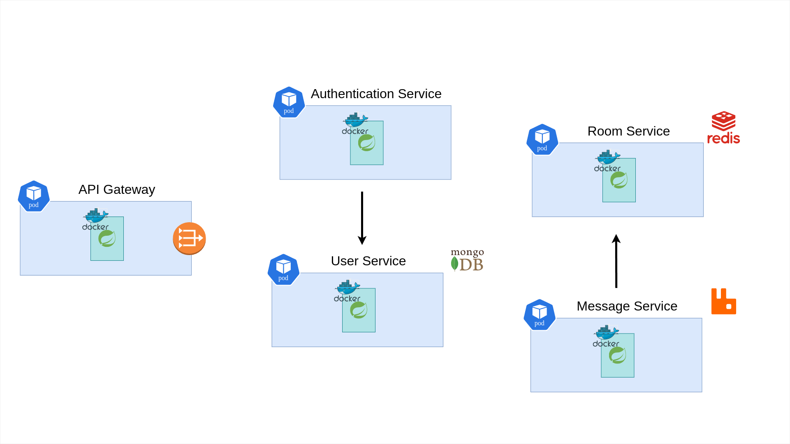

# Real-Time Chat Application

This application is designed as a real-time chat application, allowing users to create chat rooms about arbitrary subjects and chat about them.

### The application consists of 5 microservices. These are;

#### [API Gateway](https://github.com/vsayfb/api-gateway-for-chat-app)

#### [User Service](https://github.com/vsayfb/user-service-for-chat-app)

#### [Authentication Service](https://github.com/vsayfb/authentication-service-for-chat-app)

#### [Room Service](https://github.com/vsayfb/room-service-for-chat-app)

#### [Message Service](https://github.com/vsayfb/message-service-for-chat-app)

Every service has its own description, so visit the repository of the respective service to examine what it does.

### High-level Overview of the Application

## Running the Application

#### Running in the Development Environment

Clone all repositories with :

`./clone.sh`

or manually.

Run each docker-compose.yml file in the cloned repositories.

The API will be accessible at _http://localhost:8080/api/_.

#### Running in the Production Environment

Clone all repositories with :

`./clone.sh`

or manually.

Start a Kubernetes cluster. For example, for Minikube, run:

`minikube start`

Switch to Minikube's Docker daemon with:

`eval $(minikube docker-env)`

Build each Dockerfile in the cloned repositories with the tag name specified in the _deployment.yml_ of the respective repository.

`docker build -t (image-name) .`

Deploy the image to the cluster with:

`kubectl apply -f deployment.yml`

The API will be accessible at _http://$(minikube ip):30999/api/_.
